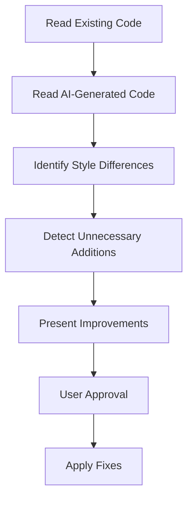

# Deslop - AI Code Cleanup Tool

## Purpose

Identifies "unnecessary additions" in AI-generated code and improves it to match existing codebase style.

## Detection & Removal Targets

### 1. Excessive Comments
- Redundant comments explaining obvious code
- Line-by-line explanatory comments
- Repetition of what the code clearly shows

**Example**:
```python
# Get the user's name
name = user.get_name()  # Call get_name method to retrieve username

# Check if name exists
if name:  # Verify name is not empty
    # Display the name
    print(name)  # Output name to console
```

### 2. Over-Defensive Error Handling
- Catching exceptions that cannot occur
- Excessive validation
- Unnecessary try-except blocks

**Example**:
```python
try:
    # Internal function with extremely low chance of exception
    result = calculate_sum(a, b)
except Exception as e:
    logger.error(f"Unexpected error: {e}")
    return None
```

### 3. Unnecessary Abstractions
- Helper functions used only once
- Over-application of design patterns
- Over-engineering for hypothetical future extensibility

### 4. Style Inconsistencies
- Naming conventions different from existing code
- Inconsistent indentation/formatting
- Code structure not matching project standards

## Usage

### Step 1: Analyze Codebase Style

First, understand existing codebase patterns:

```bash
# Read key files to understand existing style
Read src/main.py
Read src/utils.py
```

### Step 2: Review AI-Generated Code

Load the file to review:

```bash
Read src/new_feature.py
```

### Step 3: Identify Issues

Analyze code from these perspectives:

1. **Comment Density**: Excessive compared to existing code?
2. **Error Handling**: Too defensive compared to existing patterns?
3. **Naming Conventions**: Following project conventions?
4. **Function Granularity**: Unnecessarily split?
5. **Abstraction Level**: Over-abstracted?

### Step 4: Present Improvement Suggestions

Point out specific improvements and provide revised version:

```markdown
## Improvement Points

### 1. Remove Excessive Comments
- Lines: 15-20
- Reason: Code is self-evident, comments unnecessary
- Fix: Remove comments, clarify function name if needed

### 2. Simplify Error Handling
- Lines: 45-52
- Reason: This function cannot throw exceptions
- Fix: Remove try-except block

### 3. Unify Naming Convention
- Variable: `userName` → `user_name`
- Reason: Existing code uses snake_case
```

### Step 5: Apply Fixes

Apply improvements based on suggestions.

## Analysis Perspectives

### Code Quality Evaluation Criteria

1. **YAGNI Compliance**: No features implemented that aren't currently needed?
2. **DRY Compliance**: Duplication appropriately eliminated?
3. **KISS Compliance**: Not unnecessarily complex?

### Consistency with Existing Code

- **File Structure**: Following existing split patterns?
- **Naming Conventions**: Variables, functions, classes following standards?
- **Error Handling**: Following existing error handling patterns?
- **Comment Style**: Matching existing comment volume/style?

## Cautions

### Do NOT Remove

1. **Domain Knowledge Comments**: Comments explaining "why" of business logic
2. **Edge Case Handling**: Exception handling for cases that can actually occur
3. **Regulatory Requirements**: Code required for security/compliance
4. **Performance Optimizations**: Intentional optimization code

### Careful Judgment Required

1. **Future Extensibility**: Is it truly unnecessary, or needed in near future?
2. **Test Code**: Test verbosity may be acceptable for readability
3. **API Boundaries**: Defensive code may be necessary at external API interfaces

## Workflow



## Output Format

Analysis results presented in this format:

```markdown
## Deslop Analysis Report

### Summary
- File Analyzed: src/new_feature.py
- Issues Detected: 5
- Recommended Changes: 3

### Details

#### 1. Excessive Comments (Priority: High)
- **Location**: Lines 15-25
- **Issue**: Each line has comments explaining code behavior
- **Reason**: Code itself is clear, comments are redundant
- **Fix**: Remove comments, rename function from `process_user_data` to `validate_and_save_user`

#### 2. Unnecessary Error Handling (Priority: Medium)
- **Location**: Lines 45-52
- **Issue**: Blanket try-except for internal function call
- **Reason**: This function is guaranteed not to throw exceptions
- **Fix**: Remove try-except block

### Improved Code

[Present revised code]
```

## Best Practices

1. **Understand Existing Code First**: Always check existing codebase patterns before judging
2. **Incremental Improvements**: Don't change everything at once, address high priority items first
3. **Clarify Reasons**: Always explain why changes are necessary
4. **Confirm with User**: Always get approval before deletions or changes
5. **Run Tests**: Always verify tests pass after changes

## Related Commands

- `/review`: General code review
- `/security-review`: Security-focused review
- Test tools: Run tests after changes

## References

- YAGNI Principle: https://martinfowler.com/bliki/Yagni.html
- Code Comment Best Practices
- Project-specific style guides (refer to CLAUDE.md, etc.)
